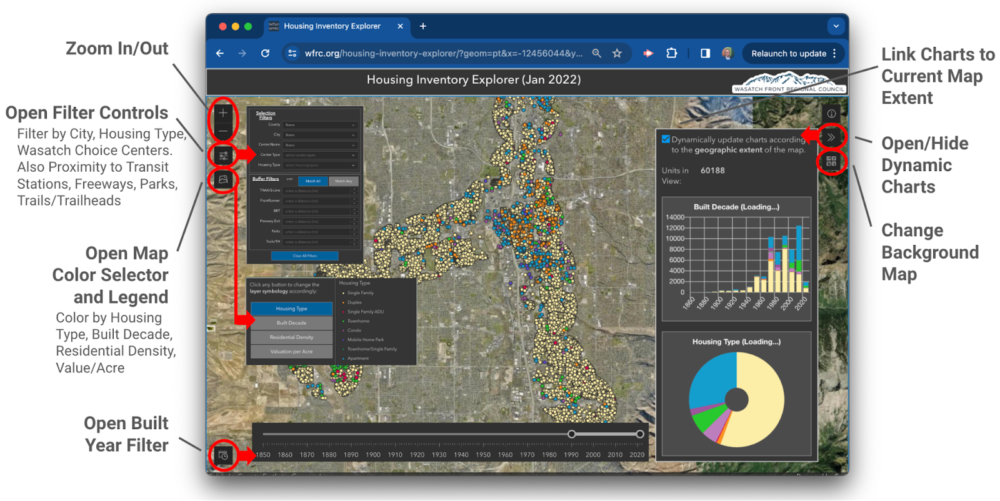

# Housing-Unit-Inventory-Explorer 2.0

## Background

The location and types of existing housing stock are key inputs to WFRC's land use models that support forecasting where residents will live and work in the coming decades. Our [household and jobs forecast](https://wfrc.org/household-job-forecast-map), in turn, informs long range transportation and other planning.  

Version 2.0 of the [Housing Inventory Explorer](https://wfrc.org/housing-inventory-explorer) web map (developed using the ESRI Maps SDK for Javascript) is an update to the initial site which was released in early January 2022. The purpose of this tool is extend data the data that WFRC already prepares, to allow anyone to explore housing trends across the region – answering the general questions: 

- **What types of housing choices are available to Wasatch Front residents, generally, and in the city and town centers that local communities envision?**
- **How well does historic and recent housing development match with the locations where major public investments have already been made in transportation infrastructure (like transit and freeways) and other neighborhood amenities (parks, trails, etc)?**  

## Getting Started:

The Housing Inventory Explorer has a number of powerful tools to filter the housing inventory dataset and change how it is displayed/colored on the map. The selection filters, buffer filters, and display controls are located on the left side of the map. The time slider is located in the bottom left The dynamic charts, basemap selector, and zoom button are located on the right side of the map. The graphic below describes the map’s buttons (circled in red) that are used to access various map tools.

## Tips & Tricks

- To filter the data to one specific year, move the start year of the slider to the desired year, then set the end year equal to start year + 1. Example: for 2022, set the slider to 2022-2023
- This application remembers the user’s selections and filters via url parameters. You can share your results with others or embed them in another web page by copying and pasting the url.
- After drawing a custom polygon, you can edit the vertices of the shape by clicking anywhere within the polygon. You may have to click twice.

## Data Currency:

The Housing Unit Explorer uses the most current data available. Please see the our full [App Details Write-up](https://docs.google.com/document/d/1dmgoN0SSVyjYOIDhS_r3c9cc5MlXL709iMiZwK8l1XA/edit?tab=t.0) for more information.

## Data Sources:

The **housing parcel data** shown was adapted to this application by WFRC and MAG staff from: Box Elder, Davis, Morgan, Salt Lake, Tooele, Washington, and Weber County Assessors via UGRC (unit count estimates for multifamily housing and grouping of housing with associated 'common areas' by WFRC), Utah County GIS and Assessors office; **Local Boundaries, Parks, Trails, Trailheads**: UGRC; **Wasatch Choice Centers**: WFRC; **Transit Stations**: UTA; **Freeway Exits** (UGRC, WFRC).

## Contact:
For more about this web map or the housing inventory dataset, contact [analytics@wfrc.org](analytics@wfrc.org).

